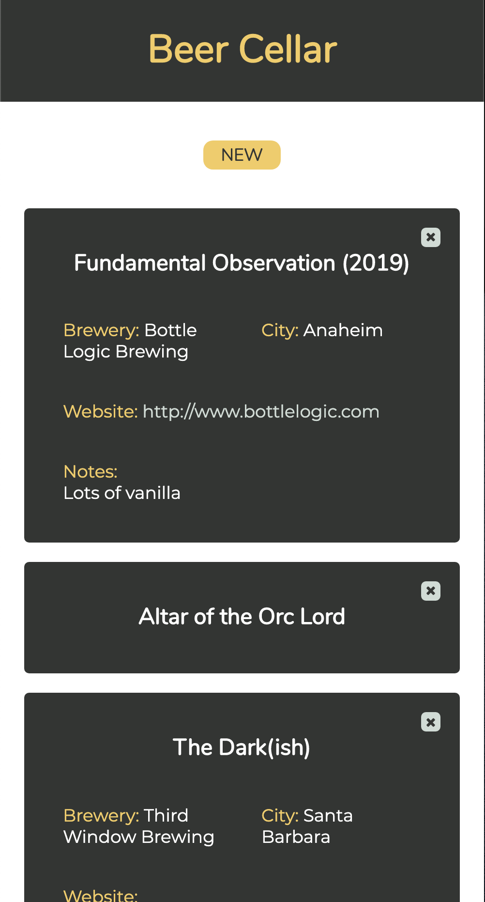

# Beer Cellar

A dynamic JavaScript application designed and built by me to maintain a digital inventory of my beer collection.

Utilizes AJAX to retrieve brewery data from the OpenBreweryDB API and use the response to create a polished dropdown menu.

### Technologies Used
* HTML5
* CSS3
* JavaScript
* AJAX

### Features
* Users can add beer to their 'cellar'
* Users can view a gallery of their 'cellar'
* Users can add notes to their entries.
* Users can add brewery data about their beers by just selecting the brewery name from an easy search feature.
* Users can delete beers from their 'cellar'

### Preview

### Planned Additions
* User can cancel an active addition into the 'cellar'.
* User can edit their 'cellar' entries.
